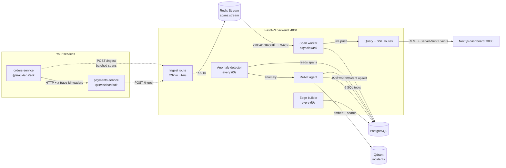

# Stacklens

**Distributed tracing and measurement platform — with an AI agent that investigates its own incidents.**

Add one import to a Node.js service and every request it handles becomes a distributed trace: a timeline showing which service called which, how long each hop took, and where it failed. When error rates or latency spike, an autonomous agent queries the trace data through SQL tools, writes a root-cause post-mortem, and files it into a vector store so the *next* investigation can retrieve it.

[](https://github.com/panditshivammishra/Stacklens/actions/workflows/ci.yml)


---

## Table of contents

- [The problem](#the-problem)
- [Architecture](#architecture)
- [How a request becomes a trace](#how-a-request-becomes-a-trace)
- [The AI layer: ReAct agent + RAG](#the-ai-layer-react-agent--rag)
- [Features](#features)
- [Tech stack](#tech-stack)
- [Engineering decisions worth reading](#engineering-decisions-worth-reading)
- [Quick start](#quick-start)
- [API reference](#api-reference)
- [Testing and CI](#testing-and-ci)
- [Project layout](#project-layout)
- [Roadmap](#roadmap)

---

## The problem

A single user action — "place an order" — touches four services. When it's slow, every service's logs say the same thing: *"I was fine, the one I called was slow."* Logs are per-process; the request is cross-process. Nothing in a log file tells you the shape of the whole journey.

Distributed tracing fixes this by giving one request a single **trace id** that travels with it across process boundaries, and recording each hop as a **span** with a parent pointer. Reassemble the spans by parent and you get the waterfall: which call blocked which, and where the time actually went.

Stacklens is that system, built end to end — the SDK that produces spans, the pipeline that ingests them, the store that aggregates them, the dashboard that renders them, and an AI agent that reads them when something breaks.

---

## Architecture



Three data stores, each doing the one job it's best at:

| Store | Holds | Why this one |
|---|---|---|
| **Redis Streams** | The ingest buffer | Append-only log with consumer groups — gives at-least-once delivery and crash replay for free |
| **PostgreSQL** | Spans, services, edges, incidents, auth | Relational joins for the trace tree, `PERCENTILE_CONT` for latency, JSONB for per-span-type metadata |
| **Qdrant** | Incident embeddings | Nearest-neighbour search over 3072-dim vectors — something a B-tree index cannot do |

---

## How a request becomes a trace

**1 — The SDK starts a span.** `AsyncLocalStorage` acts as a backpack that follows the async call chain, so any function inside the request can find the current span without it being passed as a parameter.

**2 — Outbound HTTP is auto-instrumented.** The SDK monkey-patches Node's `http` and `https` modules. Every outgoing request creates a child span and attaches `x-trace-id`, `x-parent-span-id` and `x-service-id` headers.

**3 — The callee adopts the context.** Its middleware reads those headers and runs the request inside that trace, so both services' spans share one trace id — across two processes.

**4 — Spans are buffered and flushed.** Batched in memory, flushed every 5s to `POST /ingest`. The buffer is bounded and drops oldest-first, so a dead backend can never grow a customer's memory without limit.

**5 — Ingest returns in ~1 ms.** The route does not touch Postgres. It pipelines `XADD`s onto a length-capped Redis stream and returns `202 Accepted`. Producer latency stays independent of database throughput.

**6 — The worker drains the stream.** An `asyncio` background task runs `XREADGROUP` (batches of 100, 2s block), writes to Postgres, then `XACK`s. Unacked messages are replayed on the next boot — so a crash mid-batch loses nothing.

**7 — The dashboard updates live.** The same worker pushes each batch to connected browsers over Server-Sent Events, filtered per-org.

---

## The AI layer: ReAct agent + RAG

This is the part most worth reading. It's a closed loop: **the agent's own output becomes the knowledge base for its next investigation.**

### Detection

A background task wakes every 60 seconds and checks each service for two anomaly classes, both computed in SQL against a rolling baseline:

- **Error spike** — error rate over the last 5 minutes exceeds 10%, compared against the trailing hour
- **Latency spike** — p95 in the last 5 minutes against the p95 of the preceding hour

No fixed thresholds to tune: each service is compared to its own recent normal.

### Investigation — the ReAct loop

**ReAct** = *Reason → Act → Observe*, repeated. Instead of asking a model to guess a root cause from a prompt, you give it tools and let it gather its own evidence.

```
anomaly ─► model reasons ─► calls a tool ─► reads the result ─► reasons again ─► ... ─► post-mortem
                                  └──────────── up to 8 rounds ─────────────┘
```

Six read-only tools, each a parameterised SQL query:

| Tool | Answers |
|---|---|
| `get_recent_spans` | What actually happened, optionally errors only |
| `get_error_summary` | Which operations are failing, and how often |
| `get_latency_stats` | p50 / p95 / p99 per operation via `PERCENTILE_CONT` |
| `get_trace` | One full request tree, ordered by start time |
| `get_service_dependencies` | Who calls whom, with volume and average duration |
| `find_similar_past_incidents` | **The RAG retrieval step** — semantic search over past incidents |

The loop ends when the model replies with text instead of a tool call. That text is parsed as JSON into a `rootCause` paragraph and a markdown `postMortem`, and written to Postgres.

### Provider-agnostic with failover

`providers.py` defines a neutral `LLMProvider` protocol; `runner.py` imports **no vendor SDK at all**. Adapters translate to Gemini and to any OpenAI-compatible endpoint — which covers OpenAI, Groq and a local Ollama with only a base-URL change.

```bash
AGENT_MODELS=gemini:gemini-2.5-flash,openai:gpt-4o-mini
```

If a provider dies mid-investigation, the whole investigation restarts on the next one with a fresh conversation — simpler and safer than handing a half-finished tool-calling transcript between vendors with different message formats.

### RAG — retrieval-augmented generation

**The idea in one line:** an embedding model turns text into a vector that encodes *meaning*, so "checkout endpoint timing out" and "payment API request taking too long" land near each other despite sharing almost no words. Semantic search becomes nearest-neighbour geometry.

**Write side** — every time the agent finishes an investigation:

```python
vector = await embed_text(f"{anomaly.type} on {anomaly.service_id}: {root_cause}")
await upsert_incident(incident_id, vector, {
    "service_id": ..., "type": ..., "root_cause": root_cause,
})
```

Stored in Qdrant with **cosine distance** — vectors compared by angle, not length, which is the right metric for text embeddings.

**Read side** — the `find_similar_past_incidents` tool embeds the model's plain-language description of the current symptom and returns the 3 nearest past incidents with their root causes. The system prompt nudges the agent to try this *early*, so a recurring failure is recognised rather than re-derived from scratch.

**Two deliberate design choices:**

*Embeddings never fail over between providers.* A Gemini vector (3072-dim) and an OpenAI vector (1536-dim) are not comparable — like a distance in metres versus a distance in "number of my footsteps". Mixing them doesn't degrade the answer, it makes it meaningless. So exactly one embedding model is chosen once at startup from whichever key is present, and every vector for the life of the deployment comes from it. Chat models fail over; embedding models must not.

*RAG never blocks the core write.* The incident is committed to Postgres **before** any embedding is attempted. If Qdrant is down or the embedding API times out, the incident is still safe — only its searchability is lost. `embedding_id` stays `NULL`, which doubles as a marker a future backfill job can target with `WHERE embedding_id IS NULL`.

Embedding calls carry a 20-second timeout, because the Gemini SDK retries internally for minutes before giving up — which once turned a test run into a 50-minute hang.

---

## Features

**Tracing**
- Zero-config auto-instrumentation of Node.js outbound HTTP
- Cross-process trace context propagation via headers + `AsyncLocalStorage`
- Gantt-style trace waterfall with parent/child nesting
- Force-directed service dependency map

**Ingestion**
- Redis Streams consumer group, at-least-once delivery
- Idempotent Postgres upserts → exactly-once storage
- Crash recovery by replaying unacked pending messages
- Length-capped stream for bounded memory under load

**Measurement**
- p50 / p95 / p99 latency via `PERCENTILE_CONT`
- Error rate and requests-per-second via `FILTER (WHERE ...)`
- Self-healing service-edge graph rebuilt on a rolling 24h window
- Live span feed over Server-Sent Events

**AI**
- Autonomous anomaly detection against per-service rolling baselines
- ReAct agent with 6 read-only SQL tools
- Multi-provider failover (Gemini / OpenAI / Groq / Ollama)
- RAG over past incidents with Qdrant + cosine similarity
- Generated markdown post-mortems

**Security and multi-tenancy**
- Ownership chain: `user → org → service → span`
- bcrypt password hashing, JWT session cookies (`HttpOnly`, `SameSite`)
- Per-service API keys, stored hashed, looked up by indexed prefix
- Ingest stamps `service_id` **from the key**, overwriting whatever the payload claims — cross-tenant span spoofing is structurally impossible
- SSE streams filtered per-org, so one tenant's live feed can never leak to another

---

## Tech stack

| Layer | Technology |
|---|---|
| **Backend** | Python 3.13, FastAPI, Pydantic, `asyncio`, Uvicorn |
| **Database** | PostgreSQL 16 via `asyncpg` (pooled), JSONB, composite indexes |
| **Queue** | Redis 7 Streams — consumer groups, pipelining |
| **Vector DB** | Qdrant 1.9 — cosine similarity, 3072-dim |
| **AI** | Google Gemini, OpenAI-compatible adapters, ReAct tool-calling, RAG |
| **Auth** | bcrypt, PyJWT, HttpOnly cookies, hashed API keys |
| **SDK** | TypeScript, zero runtime dependencies, `AsyncLocalStorage` |
| **Dashboard** | Next.js 16 (App Router), React 19, Tailwind v4, Server-Sent Events |
| **Infra** | Docker Compose, GitHub Actions CI with service containers |
| **Testing** | pytest, pytest-asyncio, `asgi-lifespan` — 80 tests against real infrastructure |

---

## Engineering decisions worth reading

<details>
<summary><b>Counting events incrementally loses data permanently</b></summary>

The service map was silently empty. The original code built caller→callee edges one span at a time.

The obvious fix — for each child span, look up its parent's service — breaks on **arrival order**. When A calls B, A's span only *ends* once B has replied, so A's span is usually flushed *after* B's. Processing B's span, the parent row doesn't exist yet, the lookup finds nothing, and that edge is lost forever. Incremental counters cannot repair themselves.

The fix: stop counting, start deriving. Every 60 seconds, recompute the entire edge set from the span tree with a self-join on `parent_span_id` over a rolling 24-hour window.

- **Order-independent** — a late parent is picked up on the next pass
- **Self-healing** — a wrong result is overwritten, never accumulated
- **No double counting** — it's a recompute, not an increment
- **Self-expiring** — a decommissioned link simply stops appearing

This is the standard answer to late-arriving events in any event pipeline.
</details>

<details>
<summary><b>Trusting the payload for identity makes spoofing free</b></summary>

`/ingest` used to read `serviceId` straight out of the JSON body. Anyone who could reach the port could write spans as any service — poisoning another team's dashboard or burying a real incident under noise, undetectably.

Now the caller presents an API key scoped to exactly one service, and the route **stamps** that service id over whatever the payload claimed. The body has no say. The key resolves to `<org_id>:<name>`, so two orgs can both run a service called `api` without their spans ever mixing.
</details>

<details>
<summary><b>`http.get` silently bypassed the tracer</b></summary>

Patching `http.request` doesn't patch `http.get` — Node's `get` captured a reference to the original `request` at module load. Every `http.get` call went untraced.

The first fix threw `ERR_HTTP_HEADERS_SENT`, because `get` calls `req.end()` immediately, closing the headers before the tracer could add any. The working fix rebuilds `get` on top of the *patched* `request`, then calls `req.end()` itself.
</details>

<details>
<summary><b>A dependency that only existed by accident</b></summary>

The SDK imported the `uuid` package, which was never declared in its `package.json`. It resolved only because a since-deleted sibling service had hoisted it into the root `node_modules`. The SDK could not be built from a fresh clone — invisible on the machine it was written on.

Caught the first time CI built it on a clean runner. Replaced with Node's built-in `randomUUID`, leaving the SDK with **zero third-party runtime dependencies** — which matters, because an SDK installs into other people's applications and every dependency it carries becomes their problem.
</details>

<details>
<summary><b>Two wire formats for one type</b></summary>

REST returned `snake_case` rows from Postgres; the SSE live feed pushed the SDK's `camelCase` objects straight through. The dashboard crashed on the first live span. Fixed at the source — the broadcast layer now reshapes spans to the same row shape REST returns, so one TypeScript type describes both pipes.
</details>

<details>
<summary><b>Pinning a client ahead of its server</b></summary>

`qdrant-client` 1.12's `query_points()` needs the Query API added in Qdrant **server** 1.10; Compose pins server 1.9.2, so it 404s. The vector store uses the long-stable `.search()` endpoint instead.
</details>

---

## Quick start

**Prerequisites:** Docker Desktop, Python 3.13+, Node.js 22+

```bash
git clone https://github.com/panditshivammishra/Stacklens.git
cd Stacklens
cp .env.example .env          # optional: add GEMINI_API_KEY to enable the AI agent
```

**1. Infrastructure**

```bash
docker compose up -d          # postgres:5432  redis:6379  qdrant:6333  pgweb:8081
```

**2. Backend** — creates its own schema on first boot

```bash
cd backend-py
python -m venv .venv && .venv\Scripts\activate       # Windows
# python3 -m venv .venv && source .venv/bin/activate # macOS / Linux
pip install -r requirements.txt
uvicorn app.main:app --reload --port 4001
```

**3. Dashboard**

```bash
npm install
npm run build -w sdk
npm run dev                   # http://localhost:3000
```

**4. Generate traffic** — two demo services that call each other

```bash
npm run testapp:payments      # :5102
npm run testapp:orders        # :5101 — drives ~1 req/s through both
```

Sign up at `http://localhost:3000`, create a service in **Settings** to get an API key, and drop it into the test app. Spans appear in the live feed within seconds.

> `http://localhost:8081` opens **pgweb** — a browser UI onto Postgres for reading the real tables. Dev-only: no password, never expose it.

---

## API reference

**Auth** — cookie session
| Method | Route | Purpose |
|---|---|---|
| `POST` | `/auth/signup` | Create org + first user |
| `POST` | `/auth/login` | Set `HttpOnly` session cookie |
| `POST` | `/auth/logout` | Clear cookie |
| `GET` | `/auth/me` | Current user + org |

**Admin** — cookie protected
| Method | Route | Purpose |
|---|---|---|
| `POST` | `/api/services` | Register a service (stamps `org_id`) |
| `GET` | `/api/services/manage` | Services owned by this org |
| `GET` / `POST` | `/api/keys` | List and mint API keys (raw key shown once) |
| `DELETE` | `/api/keys/{key_id}` | Revoke a key |

**Ingest** — API-key protected
| Method | Route | Purpose |
|---|---|---|
| `POST` | `/ingest` | Accept a span batch → `202`, service id taken from the key |

**Query** — cookie protected, org-scoped
| Method | Route | Purpose |
|---|---|---|
| `GET` | `/api/services` | Services with p95, error rate, RPS |
| `GET` | `/api/spans` | Recent spans, filterable |
| `GET` | `/api/trace/{trace_id}` | Every span in one trace |
| `GET` | `/api/service-map` | Dependency nodes + edges |
| `GET` | `/api/incidents` | AI post-mortems |
| `GET` | `/api/stats` | Totals, errors, p95, RPS |
| `GET` | `/api/sse` | Live span + incident stream |

---

## Testing and CI

**80 tests** run against **real** Postgres, Redis and Qdrant — not mocks. Mocks agree with whatever you assume; they would not have caught the service-map or Qdrant-version bugs. `asgi-lifespan` runs the app's real startup and shutdown in-process, so background workers are exercised too.

```bash
cd backend-py
pytest                        # all 80
pytest -m "not slow"          # 74 — skips the 6 that call real embedding APIs
```

| Suite | Covers |
|---|---|
| `test_auth.py` | Signup, login, cookies, JWT lifecycle |
| `test_crypto.py` | bcrypt hashing, API-key generation and verification |
| `test_ingest.py` | Key enforcement, service-id stamping, stream writes |
| `test_isolation.py` | Cross-tenant leakage — the security boundary |
| `test_keys.py` | Minting, listing, revocation |
| `test_query.py` | Aggregation correctness (p95, RPS windows) |
| `test_rag.py` | Embedding + Qdrant round-trip *(marked `slow`)* |
| `test_worker.py` | Consumer group, idempotency, SSE payload shape |

CI runs on every push and pull request to `main`, in two parallel jobs:

- **Backend** — Postgres, Redis and Qdrant as service containers pinned to the Compose versions, with health-gated startup, then `pytest -m "not slow"`
- **Frontend** — `npm ci`, build SDK + dashboard (both type-check), lint

Secrets are handled three ways by intent: a throwaway `JWT_SECRET` where only *a* value is needed, GitHub encrypted secrets where the real value is required, and skipped tests where the call would burn paid quota.

---

## Project layout

```
stacklens/
├─ backend-py/              FastAPI backend
│  ├─ app/
│  │  ├─ main.py            Lifespan: DB pool, Redis, Qdrant, 3 background tasks
│  │  ├─ config.py          Single env-loading module
│  │  ├─ models.py          Pydantic request/response schemas
│  │  ├─ routes/            auth · admin · ingest · query · sse
│  │  ├─ workers/           Span worker + service-edge builder
│  │  ├─ agent/             detector · runner (ReAct) · tools · providers
│  │  │                     embeddings · vectorstore  ← RAG
│  │  ├─ auth/              bcrypt, JWT, API-key dependencies
│  │  └─ db/                asyncpg pool, Redis client, schema.sql
│  └─ tests/                80 tests against real infrastructure
├─ sdk/                     @stacklens/sdk — zero-dependency TypeScript
│  └─ src/                  tracer · middleware · instrumentations/http
├─ dashboard/               Next.js 16 + React 19 + Tailwind v4
├─ types/                   Shared TypeScript types
├─ testapp/                 Two services that call each other, for demo traffic
├─ docker-compose.yml       Postgres · Redis · Qdrant · pgweb
└─ .github/workflows/ci.yml
```

---

## Roadmap

- [ ] **OTLP ingest** — accept the OpenTelemetry wire format and W3C `traceparent`, so any OTel-instrumented service in any language can report without the Stacklens SDK
- [ ] Batched multi-row span inserts (currently one statement per span)
- [ ] Published load-test numbers for sustained ingest throughput
- [ ] Span sampling for high-volume services
- [ ] Trace search by operation, duration and metadata

---

<sub>Built by <a href="https://github.com/panditshivammishra">Shivam Mishra</a> · <a href="http://linkedin.com/in/shivam-mishra-42226522b/">LinkedIn</a></sub>
